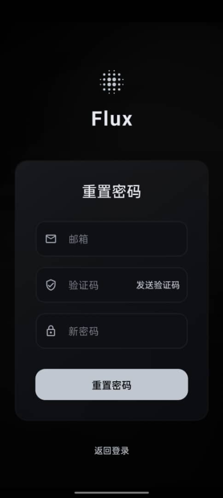
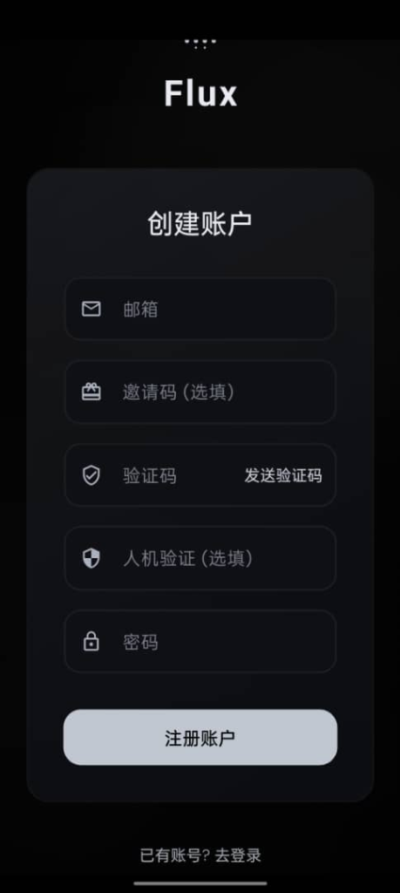
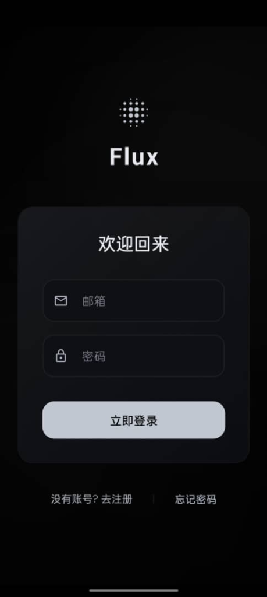
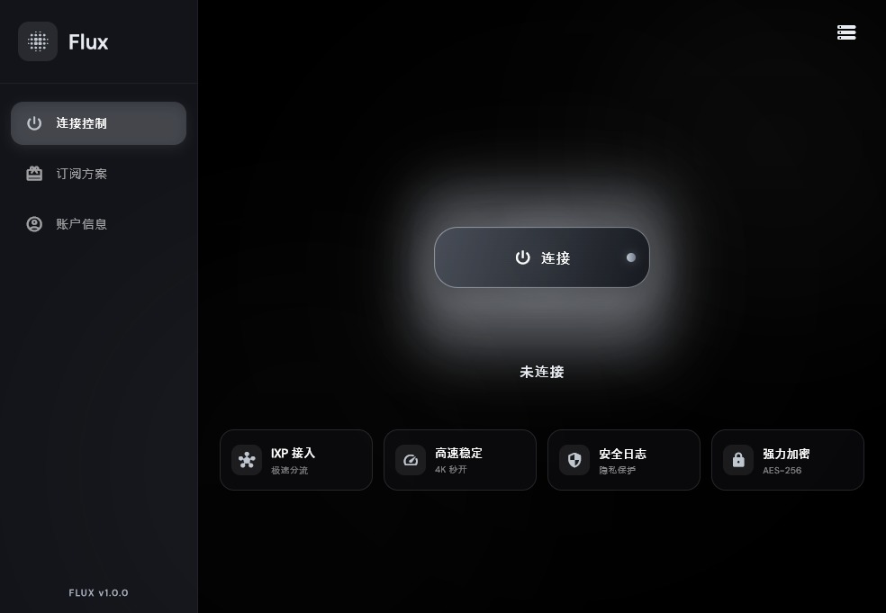

[English](README_EN.md) | [简体中文](README.md)

<div align="center">

# ⚡ Flux

### White-Label Client Solution for V2Board Operators (Android / iOS / Windows / macOS)

**Dual Core | Process Daemon | Payment Integration | Business Ready**

Change one API URL → Build → Get Your Branded App

[](https://github.com/flux-apphub/flux/stargazers)
[](https://github.com/flux-apphub/flux/network/members)
[](LICENSE)
[](https://flutter.dev)

💬 [Join Telegram Group](https://t.me/+62Otr015kSs1YmNk) · 📞 [Business @fluxdeveloper](https://t.me/fluxdeveloper)

</div>

---

## 🚀 Why Flux?

More than just a proxy client, Flux is a revenue-generating tool for service providers.

### 💎 Commerce Features (Grow Revenue)
- **Full Payment Suite**: Integrated Alipay, WeChat, Stripe, and USDT via Web Payment Jump.
- **Order Management**: View details, cancel, or renew subscriptions instantly.
- **Referral System**: Invite codes, commission tracking, and withdrawal requests.
- **Customer Support**: Built-in **Crisp** live chat and ticket system.

### 🛡️ Core Stability (Retain Users)
- **Dual Core Engine**:
  - `V2Ray`: Handles sub-updates and basic proxying.
  - `SingBox`: Powering **TUN Mode**, Reality protocol, and high-performance routing.
- **TUN Mode**: True system-level proxy (Android/Windows) for gaming and all-app support.
- **Process Daemon**: Windows PowerShell daemon to prevent core crashes and ensure persistent connections.

### 🔒 Security & Privacy
- **Encryption**: AES-128 encryption for sensitive config and API parameters.
- **Sanitized**: Zero hardcoded secrets or domains. Ready for public repo.

### 🆚 Why Flux? (Comparison)

| Feature | ⚡ Flux | 🔴 v2rayNG | 🟡 Clash | 🔵 Shadowrocket |
| :--- | :---: | :---: | :---: | :---: |
| **Cross-Platform** | **✅ 5 OS** | ❌ Android Only | ⚠️ Fragmented | ❌ iOS Only |
| **V2Board API** | **✅ Native** | ❌ Manual Import | ❌ Manual Import | ❌ Manual Import |
| **Flutter UI** | **✅ Material 3** | ❌ Native Android | ❌ Web Style | ❌ Native iOS |
| **White-Label** | **✅ Ready-to-go** | ❌ Source Change | ❌ Hard | ❌ Impossible |
| **Commercial** | **✅ MIT License** | ✅ | ⚠️ | ❌ |
| **Open Source** | **✅ 100%** | ✅ | ⚠️ Partial | ❌ |

👉 **Simply put: Flux is the only "Ready-to-use, White-label, Commercial" V2Board client solution.**

### 👥 Who is Flux For?

| User Type | Your Need | How Flux Helps |
| :--- | :--- | :--- |
| 🛫 **Airport Owner** | Want a branded client fast | ✅ Change 1 line, build in 5 mins |
| 🧑💻 **Developer** | Want a clean Flutter proxy project | ✅ MIT License, commercial ready |
| 👤 **End User** | Want a beautiful proxy tool | ✅ Ask your provider for the App |

---

## 📱 Screenshots (UI Preview)

> **Elegant UI, Smooth Animations, Dark Mode Ready**

<details>
<summary>📸 Click to View Screenshots</summary>

| Dashboard | Node List | Profile |
| :---: | :---: | :---: |
|  |  |  |

| Windows / MacOS Desktop |
| :---: |
|  |

</details>

## 🛠 Supported Protocols (Tech Specs)

Powered by **SingBox + V2Ray** Dual Core.

| Protocol | Status | Keywords |
|:---|:---:|:---|
| **Hysteria 2** | ✅ | High Speed, Anti-Censorship |
| **VLESS Reality** | ✅ | Vision, XTLS, Anti-Probing |
| **VMess** | ✅ | WebSocket, gRPC, Compatible |
| **Trojan** | ✅ | TLS Masking |
| **TUIC v5** | ✅ | 0-RTT, QUIC |
| **Shadowsocks** | ✅ | AEAD, 2022 Standard |

---

## ⚡ Quick Start (5 Mins)

```bash
# 1. Clone
git clone https://github.com/flux-apphub/flux.git
cd flux

# 2. Install dependencies
flutter pub get

# 3. Signing Config (Android)
# Copy key.properties.example to key.properties & generate key.jks
# (Skip for Debug mode)

# 4. API Configuration (Fallback)
# Open lib/services/remote_config_service.dart
# Change _defaultDomain to your panel URL (e.g., https://your-panel.com)
# *Note: This is the fallback domain. OSS Config is recommended for production.*

# 5. Run
flutter run
```

---

## 📖 Admin Integration Guide

Follow these steps to customize Flux for your service.

### Step 1: Basic Config (Required)

1.  **Package Name (App ID)**
    *   *Android*: `android/app/build.gradle.kts` -> `applicationId`
    *   *iOS*: `ios/Runner.xcodeproj/project.pbxproj` -> `PRODUCT_BUNDLE_IDENTIFIER`
    *   *Windows*: `pubspec.yaml` -> `msix_config.identity_name`
    *   *Linux*: `linux/CMakeLists.txt` -> `APPLICATION_ID`

2.  **Name & Icon**
    *   *Name*: Edit `pubspec.yaml` `name` and platform specific files.
    *   *Icon*: Replace `assets/images/app_icon.png` (1024px), run `flutter pub run flutter_launcher_icons`.

### Step 2: Backend Encryption (Anti-Abuse)

Flux encrypts sensitive params (e.g., email verify) using AES-128.

1.  Open `lib/services/v2board_api.dart`.
2.  Find `_emailVerifyKey`, set a **16-char** random string.
3.  Ensure backend supports decryption, or set `useEncryption = false`.

### Step 3: OSS Remote Config (Recommended)

Dynamic config via OSS for **Domain Switching** and **Feature Toggles**.

**1. Prepare Config**
*   Use `release_config_plaintext.json` template.
*   Set backup `domains`, `update` info, and `contact` (Crisp ID).

**2. Encrypt & Upload**
*   Set `_encryptionKey` in `lib/utils/config_encryption.dart`.
*   Set `KEY` in `encrypt_config.py` (Must match App key).
*   Run `python encrypt_config.py` to generate encrypted file.
*   Upload to OSS/CDN.

**3. Connect App**
*   Add OSS URL to `_ossUrls` in `lib/services/remote_config_service.dart`.

### Step 4: Routing Rules
*   Edit `routing_rules.json`, encrypt similarly, and link in `release_config`.

---

## 🔧 Architecture

<details>
<summary>Technical Details</summary>

### Stack
- **UI**: Flutter 3.x + Material Design 3
- **Logic**: `UnifiedVpnService`
- **Core**: V2Ray / SingBox (Dual Core)

### Platform Implementation
| Platform | Mechanism | Note |
|:---|:---|:---|
| Android | `VpnService` | TUN (No Root) |
| iOS | `NetworkExtension` | Packet Tunnel |
| Desktop | System Proxy + Sidecar | Daemon Protected |

### Directory Structure
```
lib/
├── main.dart              # Entry
├── screens/               # Pages
├── services/              # Core services
│   ├── remote_config_service.dart # 👈 Config here
│   ├── v2ray_service.dart         # V2Ray Core
│   ├── singbox_service.dart       # SingBox Core
│   └── unified_vpn_service.dart   # Unified Manager
├── models/                # Data models
└── widgets/               # Components
```

</details>

---

## 📝 Appendix: Configuration Reference

### 1. `release_config_plaintext.json`

⚠️ **Warning: DO NOT upload this file directly! Must be encrypted using `encrypt_config.py`!**

1.  Edit this file.
2.  Run `python encrypt_config.py` to generate `release_config.json`.
3.  Upload `release_config.json` to OSS.

| Field | Description | Note |
|:---|:---|:---|
| `config_version` | **Version** | **Must increment** this number to trigger App config update |
| `domains` | **Backup APIs** | `["https://api.spare.com"]` - Fallback domains |
| `update` | **App Update** | `version`, `url`, `force` flag for each platform |
| `announcement` | **Announcement** | `enabled`: Show popup, `content`: Text body |
| `contact` | **Contact Info** | `crisp_website_id`: Your Crisp Chat ID |
| `features` | **Toggles** | `purchase_enabled` (Buy), `invite_enabled` (Referral) |
| `routing_rules.url` | **Routing URL** | Link to `routing_rules.json` on OSS |
| `recommended_nodes` | **Rec. Nodes** | (Optional) List of Node Tags to show on Home |
| `backup_subscription`| **Backup Sub** | (Optional) Fallback generic V2Ray subscription URL |

### 2. `routing_rules.json` (Traffic Split)

Controls which traffic goes through proxy or direct connection.

```json
{
    "type": "field",
    "outboundTag": "direct", // Outbound: proxy, direct, or block
    "domain": ["geosite:cn"], // Domain rule: geosite:cn (China domains)
    "ip": ["geoip:cn"]        // IP rule: geoip:cn (China IPs)
}
```

---

## 💰 Commercial Services

If you need professional customization:

| Service | Description |
| :--- | :--- |
| 🎨 **UI Customization** | Custom colors, layout changes, exclusive features |
| 🔐 **Auth System** | Device authorization, Multi-device management, Expiry alerts |

Contact **[@fluxdeveloper](https://t.me/fluxdeveloper)** for support.

### ☕ Support Open Source

If Flux helps you, consider a donation:

| USDT (TRC20) | USDC (Arbitrum) | ETH (Arbitrum) |
| :---: | :---: | :---: |
|  |  |  |

---

## 🔗 Related Projects

*   [Sing-box](https://github.com/SagerNet/sing-box) - Universal Proxy Platform
*   [Xray-core](https://github.com/XTLS/Xray-core) - Network Tool
*   [V2Board](https://github.com/v2board/v2board) - Admin Panel
*   [hev-socks5-tunnel](https://github.com/heiher/hev-socks5-tunnel) - High Performance TUN

---

## 📄 License

MIT License - Free for commercial use.

---
> **Tags**: V2Board Client, White-label VPN, Flutter Proxy, Commercial VPN Source, Airport Business, Anti-Censorship, Traffic Monetization
